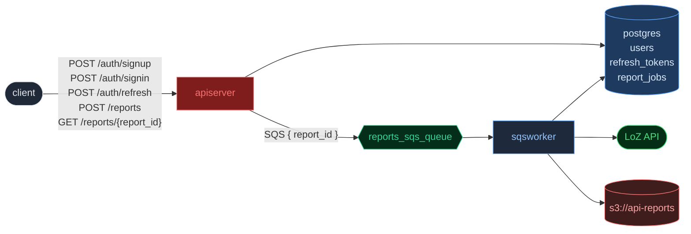

# report-forge

Async report-generation API all in LocalStack via docker compose managed through Terraform

```mermaid
flowchart LR
    client(["client"])
    apiserver["apiserver"]
    queue{{"reports_sqs_queue"}}
    postgres[("postgres<br/>users<br/>refresh_tokens<br/>report_jobs")]
    sqsworker["sqsworker"]
    lozapi(["LoZ API"])
    s3[("s3://api-reports")]

    client -->|"POST /auth/signup<br/>POST /auth/signin<br/>POST /auth/refresh<br/>POST /reports<br/>GET /reports/{report_id}"| apiserver
    apiserver -->|"SQS { report_id }"| queue
    apiserver --> postgres
    queue --> sqsworker
    sqsworker --> postgres
    sqsworker --> lozapi
    sqsworker --> s3

    style client fill:#1f2937,stroke:#e5e7eb,color:#e5e7eb
    style apiserver fill:#7f1d1d,stroke:#f87171,color:#f87171
    style queue fill:#052e1a,stroke:#34d399,color:#34d399
    style postgres fill:#1e3a5f,stroke:#60a5fa,color:#dbeafe
    style sqsworker fill:#1e293b,stroke:#60a5fa,color:#93c5fd
    style lozapi fill:#052e16,stroke:#4ade80,color:#4ade80
    style s3 fill:#3f1d1d,stroke:#f87171,color:#fca5a5
```
